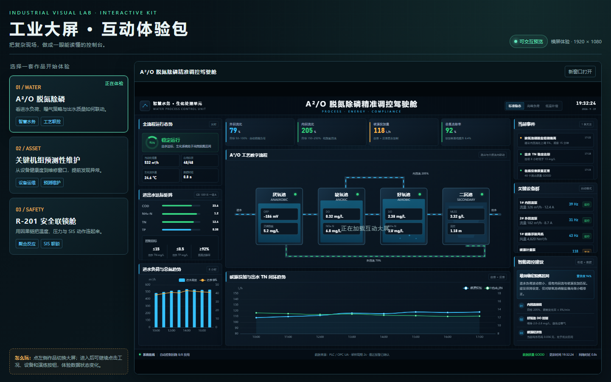
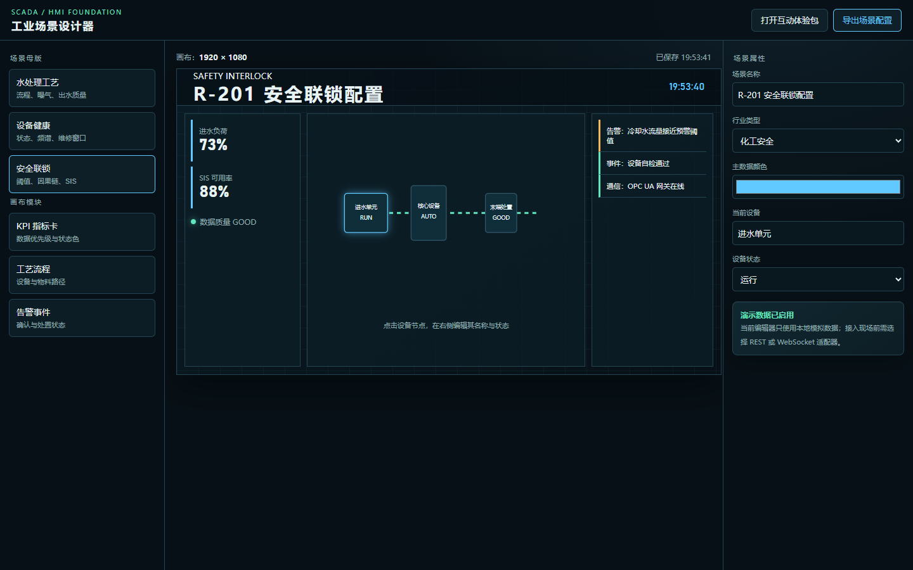

# Industrial Dashboard Studio

> 工业大屏产品化工作区 · 10 套离线可运行样板 + 可复用运行时 + SCADA 设计器 + 可交付 Skill

[](LICENSE)
[](docs/architecture.md)
[](docs/offline-delivery.md)

[English](#en) | 简体中文

---

## 简介

`industrial-dashboard-studio` 把 3 类工业监控样板沉淀为**可复用运行时、场景配置、HMI/SCADA 基础能力**和**可交付 Skill** 的产品化仓库。

- **离线可运行**：Vue 3 + ECharts 5 + Three.js 全部本地化（`vendor/`），不依赖外网 CDN
- **1920×1080 基准画布**，等比缩放适配 1366×768 / 1920×1080 / 3840×2160 与拼接屏
- **横屏优先**：入口层负责方向提示与全屏，场景层专注信息层级
- **只读演示**：内置演示数据，明确 `quality` / `timestamp` / 通信状态，不伪造现场接入

> 原始成果与运营素材保留在 `MyWord`，本仓库是产品开发的唯一工作目录。

## 在线预览

直接打开本地入口（无需构建）：

- `apps/showcase/index.html` — 横屏互动体验入口，三场景切换 + 全屏
- `apps/scada-designer/index.html` — SCADA 场景设计器，可编辑标题/主题色/设备/状态并导出 JSON

手机端请横屏使用，竖屏会自动提示旋转。




## 场景清单

| 分组 | 场景 | 文件 |
|------|------|------|
| 水处理 | A2O 生物池标准工艺看板 | `scenarios/water-treatment/01-*.html` |
| 水处理 | 厂区全景联动驾驶舱 | `scenarios/water-treatment/04-*.html` |
| 水处理 | 泵房泵站 SCADA 集中监控 | `scenarios/water-treatment/05-*.html` |
| 水处理 | A2O 生物池 SCADA 集中监控 | `scenarios/water-treatment/06-*.html` |
| 水处理 | A2O 生物池单池 SCADA | `scenarios/water-treatment/07-*.html` |
| 水处理 | 预处理段 3D 沉浸 HMI | `scenarios/water-treatment/08-*.html` |
| 水处理 | 预处理段浅色 3D 精致 HMI | `scenarios/water-treatment/09-*.html` |
| 水处理 | 最新版污水混合洗涤工艺 HMI | `scenarios/water-treatment/10-*.html` |
| 设备维护 | 关键设备预测性维护驾驶舱 | `scenarios/predictive-maintenance/02-*.html` |
| 反应安全 | 反应釜失控安全驾驶舱 | `scenarios/reactor-safety/03-*.html` |

> 另含 `assets/models/ngt200` 空气悬浮鼓风机参数化三维模型与预览页。

## 目录结构

```
apps/                  # 可运行应用入口 (showcase / scada-designer)
scenarios/             # 三组离线样板 (water-treatment / predictive-maintenance / reactor-safety)
packages/              # 运行时、组件、数据适配器、设计系统
  runtime/             # 场景加载、主题、缩放、时钟、全屏
  components/          # 工业组件样式
  data-adapters/       # demo / rest / websocket 三类适配器
  design-system/       # Token 与视觉规范
skills/                # 可复用 Skill (industrial-dashboard / industrial-hmi-classic / industrial-scada / light-3d-water-hmi)
vendor/                # 本地固化依赖 (vue, echarts, three, OrbitControls)
assets/                # 三维模型等素材
docs/                  # 架构与离线交付说明
tests/                 # 交互验收
release/               # 离线交付包与预览图
```

## 快速开始

```bash
# 1. 克隆
git clone https://github.com/Migeking/industrial-dashboard-studio.git
cd industrial-dashboard-studio

# 2. 直接用浏览器打开
start apps/showcase/index.html        # Windows
open apps/showcase/index.html         # macOS
```

无需 `npm install`，所有依赖已在 `vendor/`。

## 验证

```bash
node skills/industrial-dashboard/scripts/validate-dashboard.js scenarios
python -X utf8 tests/interaction_check.py
```

单文件校验：

```bash
node skills/industrial-dashboard/scripts/validate-dashboard.js scenarios/water-treatment/08-*.html
node skills/industrial-hmi-classic/scripts/validate-hmi.js <file>
node skills/industrial-scada/scripts/validate-scada.js <file>
```

## 离线交付

```powershell
./scripts/build-release.ps1
# 输出 -> release/industrial-dashboard-offline.zip
```

解压后打开 `apps/showcase/index.html` 即可演示。详见 [docs/offline-delivery.md](docs/offline-delivery.md)。

交付包含：体验入口与设计器、三套样板、本地依赖、三维模型、运行时与 Skill、产品文档。

## 数据接入边界

```
scenario -> data adapter -> runtime
  demo       本地定时工况脚本（默认）
  rest       轻量 REST 轮询
  websocket  实时网关推送
```

在数据契约确认前，不将演示页宣称为现场 SCADA。控制写入需转入 SCADA/HMI 安全设计（见 `skills/industrial-scada/references/control-safety-contract.md`）。

## Skill

| Skill | 用途 |
|-------|------|
| `industrial-dashboard` | 生成 1920×1080 单文件离线大屏，克制的工业精密视觉 |
| `industrial-hmi-classic` | 经典 HMI 面板与 PID 图库 |
| `industrial-scada` | 报警生命周期、点表与安全控制契约 |
| `light-3d-water-hmi` | 浅色 3D 水务 HMI 视觉体系 |

详见各 `skills/*/SKILL.md` 与 `references/`。

## 技术栈

- Vue 3 (CDN prod, 本地固化)
- ECharts 5
- Three.js + OrbitControls
- 纯 HTML/CSS/JS，单文件自包含输出

## 路线图

- [x] 三套离线样板与横屏互动入口
- [x] 运行时/组件/适配器骨架与 SCADA 配置编辑器
- [ ] 接入经确认的 REST / WebSocket 数据契约
- [ ] 现场部署与权限/降级策略

## 贡献

欢迎 Issue / PR。提交前请跑通两项验证。

## 许可

[MIT](LICENSE) © 2026 Migeking

---

<a id="en"></a>
## English Summary

Industrial Dashboard Studio is an offline-first SCADA/HMI dashboard productization workspace. 10 ready-to-run 1920×1080 dashboards, a reusable runtime, a SCADA designer and 4 deliverable Skills. All deps vendored. Demo data by default; real data via `demo`/`rest`/`websocket` adapters after contract confirmation.

```bash
git clone https://github.com/Migeking/industrial-dashboard-studio.git
open apps/showcase/index.html
```
